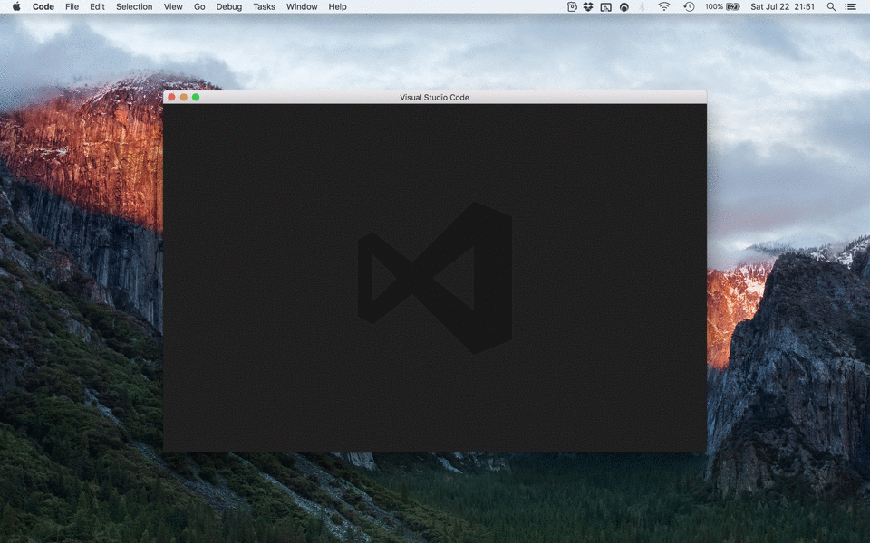
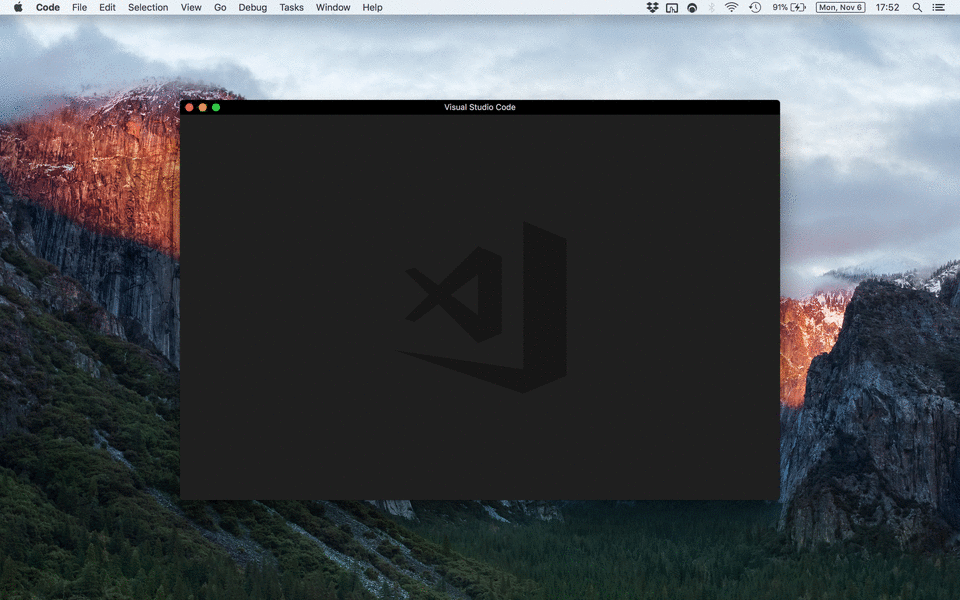
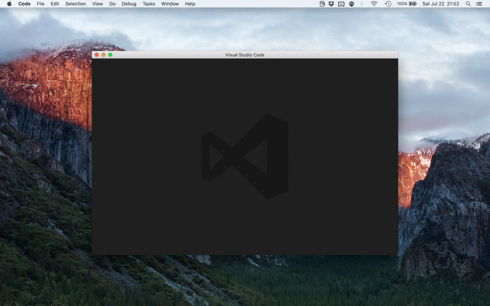
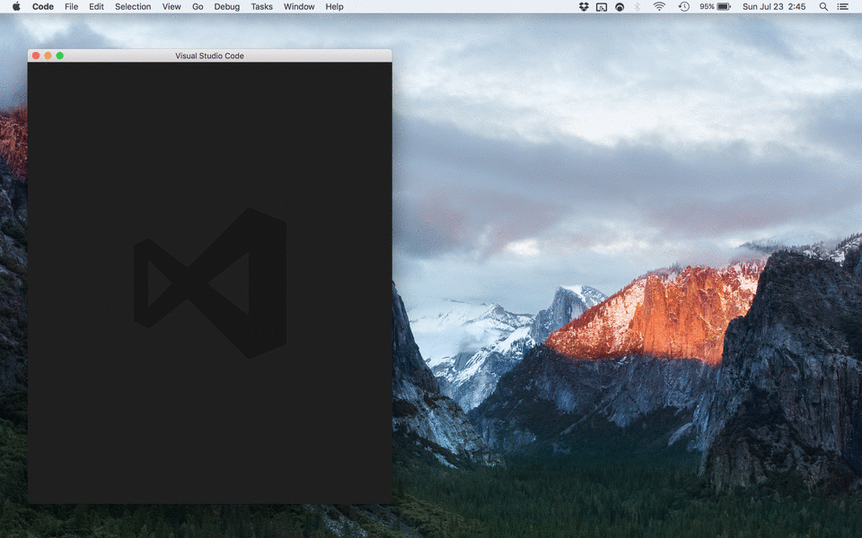
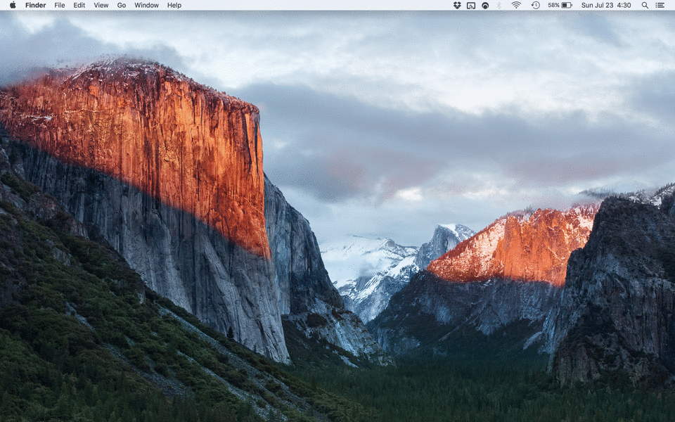
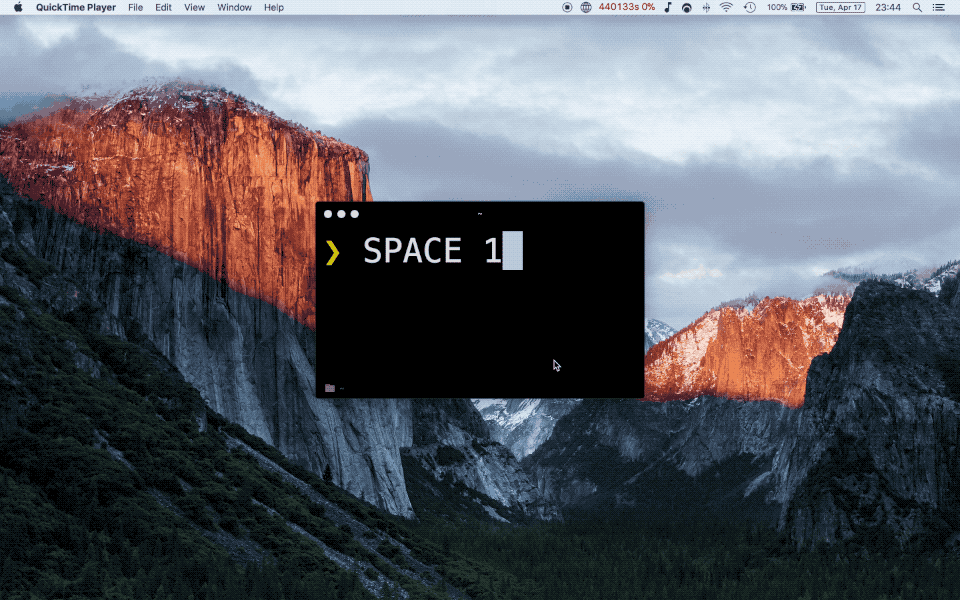
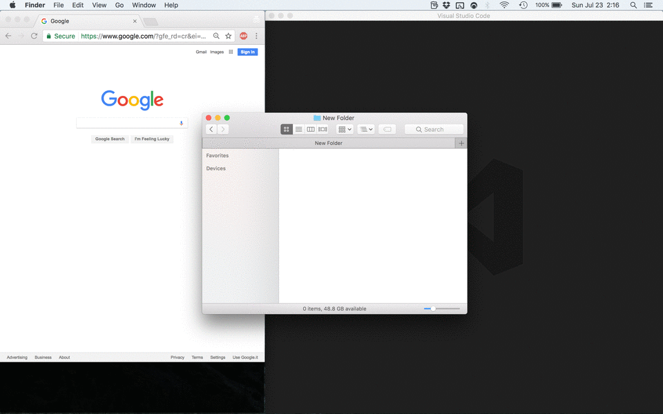
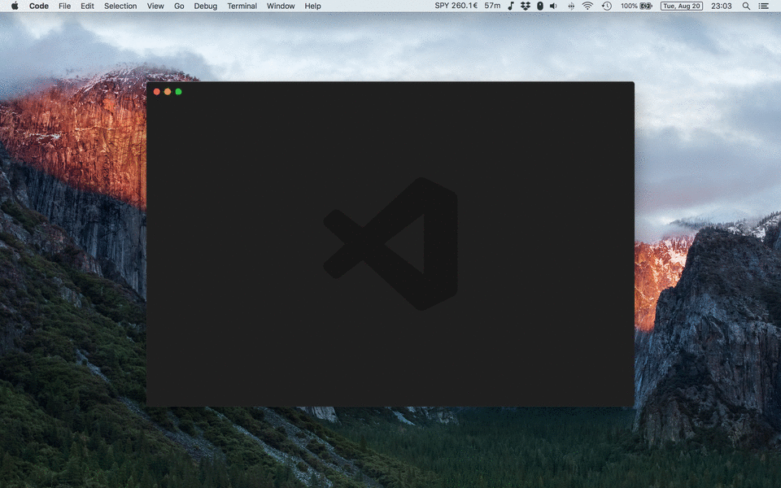
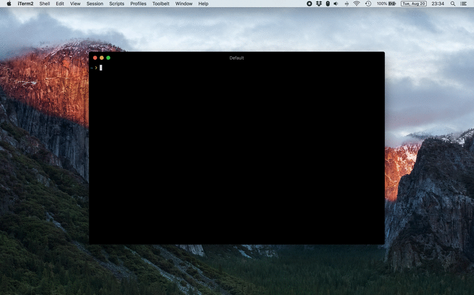
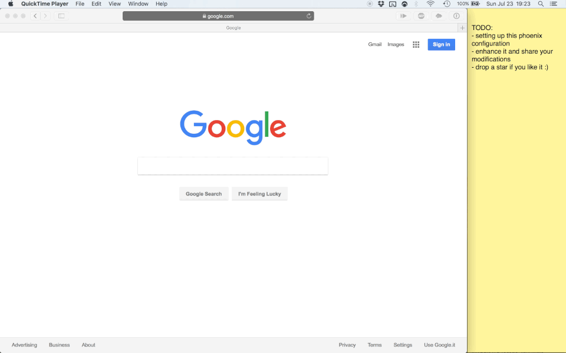

# Phoenix

My [Phoenix](https://github.com/kasper/phoenix) setup. Powerful, easy to customize, tuned for web development, adds a space switcher.

## Installation

This configuration uses a remap of the Caps Lock key to something more useful: the Hyper key <kbd>⇪</kbd> (basically just <kbd>ctrl + alt + cmd</kbd> combined into one key) if used in combination with other keys, otherwise it gets mapped to <kbd>F18</kbd>, which is used to trigger the space switcher. If you prefer you may skip these remap steps while you try the configuration, but if you usually have many spaces opened I highly recommend you not to miss out the awesome space switcher, for which this hack is a requirement.

1. Install [Phoenix](https://github.com/kasper/phoenix#install)
2. Install [Karabiner Elements](https://github.com/tekezo/Karabiner-Elements) via its [dmg](https://pqrs.org/latest/karabiner-elements-latest.dmg)
3. Replace Caps Lock with Hyper/F18 using [this](http://tinyurl.com/yc8m5qe8) Karabiner Elements configuration (if the link doesn't work copy and paste this in a browser: `karabiner://karabiner/assets/complex_modifications/import?url=https%3A%2F%2Fraw.githubusercontent.com%2Ffabiospampinato%2Fphoenix%2Fmaster%2Fconfig%2Fkarabiner.json`)
4. `$ mkdir ~/.config`
5. `$ cd ~/.config`
6. `$ git clone git@github.com:fabiospampinato/phoenix.git`
7. Restart Phoenix
8. Enjoy!

## Customization

To disable specific features, just comment out their correspondent `require` call in [phoenix.js](https://github.com/fabiospampinato/phoenix/blob/master/phoenix.js).

To tweak some numbers, simply edit [constants.js](https://github.com/fabiospampinato/phoenix/blob/master/config/constants.js).

Changing the specific shortcut used to trigger an action is pretty trivial.

Don't forget to make a PR if you fixed something or implemented something cool :)

## Shortcuts

### Sides

	

| Shortcut | Description |
| -------- | ----------- |
| <kbd>⇪ + ↑</kbd> | Move window to the top side |
| <kbd>⇪ + →</kbd> | Move window to the right side |
| <kbd>⇪ + ↓</kbd> | Move window to the bottom side |
| <kbd>⇪ + ←</kbd> | Move window to the left side |

### Corners

	

| Shortcut | Description |
| -------- | ----------- |
| <kbd>⇪ + Q</kbd> | Move window to the top-left corner |
| <kbd>⇪ + W</kbd> | Move window to the top-right corner |
| <kbd>⇪ + S</kbd> | Move window to the bottom-right corner |
| <kbd>⇪ + A</kbd> | Move window to the bottom-left corner |

### Halves

	

| Shortcut | Description |
| -------- | ----------- |
| <kbd>⇪ + [</kbd> | Move window to the 1st half |
| <kbd>⇪ + ]</kbd> | Move window to the 2nd half |

### Thirds

	

| Shortcut | Description |
| -------- | ----------- |
| <kbd>⇪ + 1</kbd> | Move window to the 1st column |
| <kbd>⇪ + 2</kbd> | Move window to the 2nd column |
| <kbd>⇪ + 3</kbd> | Move window to the 3rd column |

### Sixths

	

| Shortcut | Description |
| -------- | ----------- |
| <kbd>⇪ + shift + Q</kbd> | Move window to the 1st sixth |
| <kbd>⇪ + shift + W</kbd> | Move window to the 2nd sixth |
| <kbd>⇪ + shift + E</kbd> | Move window to the 3rd sixth |
| <kbd>⇪ + shift + A</kbd> | Move window to the 4th sixth |
| <kbd>⇪ + shift + S</kbd> | Move window to the 5th sixth |
| <kbd>⇪ + shift + D</kbd> | Move window to the 6th sixth |

### Center

	

| Shortcut | Description |
| -------- | ----------- |
| <kbd>⇪ + X</kbd> | Center the window |
| <kbd>⇪ + shift + X</kbd> | Center the window and set its dimensions to 900x600 |

### Grow

	

| Shortcut | Description |
| -------- | ----------- |
| <kbd>⇪ + shift + ↑</kbd> | Grow window from the top |
| <kbd>⇪ + shift + →</kbd> | Grow window from the right |
| <kbd>⇪ + shift + ↓</kbd> | Grow window from the bottom |
| <kbd>⇪ + shift + ←</kbd> | Grow window from the left |

### Expand

	

| Shortcut | Description |
| -------- | ----------- |
| <kbd>⇪ + space</kbd> | Toggle window expansion to fill the space |
| <kbd>⇪ + shift + space</kbd> | Toggle window expansion to fullscreen |

### Focus or Open

	

| Shortcut | Description |
| -------- | ----------- |
| <kbd>⇪ + `</kbd> | Focus to or open [Notable](https://notable.md)|
| <kbd>⇪ + C</kbd> | Focus to or open [Chrome](https://www.google.com/chrome)|
| <kbd>⇪ + D</kbd> | Focus to or open [Chrome Developer Tools](https://developer.chrome.com/devtools)|
| <kbd>⇪ + V</kbd> | Focus to or open [Visual Studio Code](https://code.visualstudio.com)|
| <kbd>⇪ + F</kbd> | Focus to or open Finder|
| <kbd>⇪ + T</kbd> | Focus to or open [iTerm](http://iterm2.com)|
| <kbd>⇪ + G</kbd> | Focus to or open [GitTower](https://www.git-tower.com/)|

### Spaces

	

In order to make this work you have to open `System Preferences -> Keyboard -> Shortcuts -> Mission Control` and bind all `Switch to Desktop [NUMBER]` actions to <kbd>ctrl + alt + cmd + shift + [NUMBER]</kbd>. There are actions up to the 9th desktop, but they may not be shown to you if you have less then 9 desktops currently open.

**Note**: If you don't need wrapping support, you should just remap the `Move left/right a space` actions under `System Preferences -> Keyboard -> Shortcuts -> Mission Control`.

| Shortcut | Description |
| -------- | ----------- |
| <kbd>⇪ + tab</kbd> | Switch to the next space |
| <kbd>⇪ + shift + tab </kbd> | Switch to the previous space |

### Applications Icons

	

| Shortcut | Description |
| -------- | ----------- |
| <kbd>⇪ + I</kbd> | For each window in the current space show an icon indicating its position |

### Reload Phoenix

	

| Shortcut | Description |
| -------- | ----------- |
| <kbd>⇪ + shift + P</kbd> | Reload Phoenix |

### Pause/Resume Application

	

This can be used for saving battery, pausing single-player games etc.

| Shortcut | Description |
| -------- | ----------- |
| <kbd>⇪ + F8</kbd> | Pause or resume the current application |

### Quit Application

	

Did you ever close 3+ Chrome windows instead of a single tab by mistake? Fear no more! Now in order to quit an app you have to trigger <kbd>⌘Q</kbd> twice in a short timeframe. Stop [wasting 10$](https://clickontyler.com/commandq) for something so basic.

| Shortcut | Description |
| -------- | ----------- |
| <kbd>⌘Q</kbd> <kbd>⌘Q</kbd> | Quit application |

### Split View

//TODO: Unfortunately there's no API available for doing this at the moment, that's a shame given that I would have finally found a use for the <kbd>§</kbd> key, it looks like 2 <kbd>S</kbd> => Side-by-Side :D

| Shortcut | Description |
| -------- | ----------- |
| <kbd>⇪ + §</kbd> | If there are only 2 windows in the current space put them in split view |

## Mouse

### Snapping

	

Drag a window to an edge or corner to snap it into place.

## Magic

### Chrome

If it gets opened, positionate it to the left side.

### Chrome Developer Tools

If it gets opened, positionate it to the bottom-right corner, and shrink Visual Studio Code's height a bit, so that the console will be visible.

If it gets closed, restore Visual Studio Code's height.

### Terminal/iTerm2/Finder

If one of these apps' windows gets opened, positionate it to bottom-left corner.

### Visual Studio Code

If it gets opened, positionate it to the right side.

## Space Switcher

	

This is the truly great addition to what was already available on the internet.

It combines [Phoenix](https://github.com/kasper/phoenix), [Alfred](https://www.alfredapp.com) and [alfred-spaces-workflow](https://github.com/fabiospampinato/alfred-spaces-workflow) into the space switcher macOS deserves but never had, always just a double Hyper (<kbd>⇪</kbd> <kbd>⇪</kbd>) away.

This is how it works:
- It uses Phoenix to compile a list of your spaces
- It tries to guess a name for those spaces, by default that would be the name of the folder opened in the Visual Studio Code instance present in that space ([get_space_name.js](https://github.com/fabiospampinato/phoenix/blob/master/helpers/get_space_name.js))
- Refreshes the list and those guessed names when necessary
- Listens for the double Hyper (<kbd>⇪</kbd> <kbd>⇪</kbd>) shortcut
- Opens [Alfred](https://www.alfredapp.com) and triggers [alfred-spaces-workflow](https://github.com/fabiospampinato/alfred-spaces-workflow)
- Which reads the list of spaces compiled with Phoenix and displays it to you
- Now just select a space to switch to

In order to make this work you have to open `System Preferences -> Keyboard -> Shortcuts -> Mission Control` and bind all `Switch to Desktop [NUMBER]` actions to <kbd>ctrl + alt + cmd + shift + [NUMBER]</kbd>. There are actions up to the 9th desktop, but they may not be shown to you if you have less then 9 desktops currently open.

**Note**: There's no API available for retrieving windows from other spaces, therefor other spaces' guessed names won't be refreshed until you visit them. The very first time you load Phoenix you might want to switch the focus to all of them, one by one, to have their names updated.

## License

MIT © Fabio Spampinato
