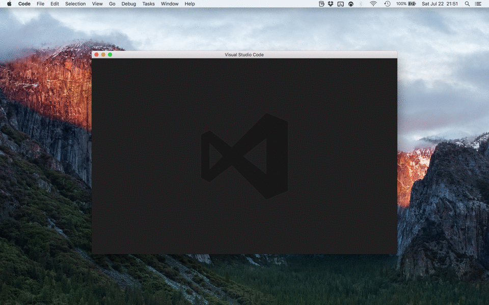
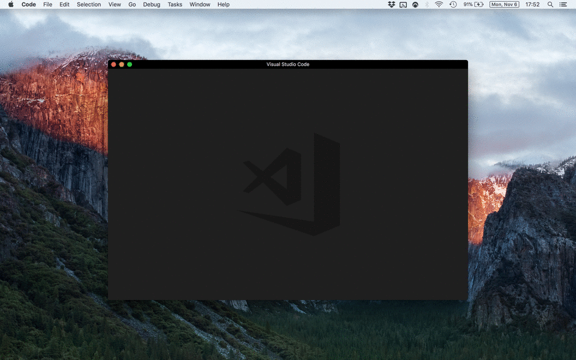
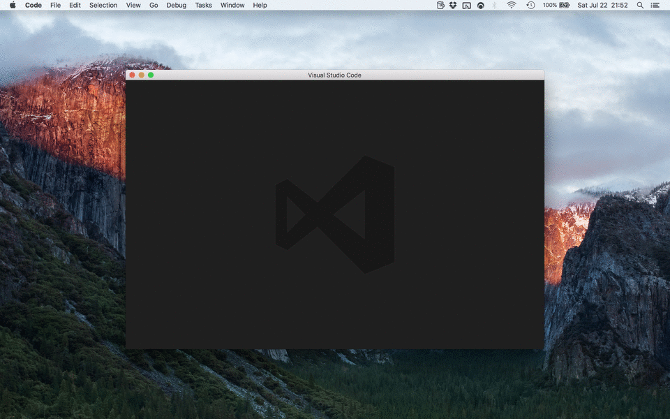
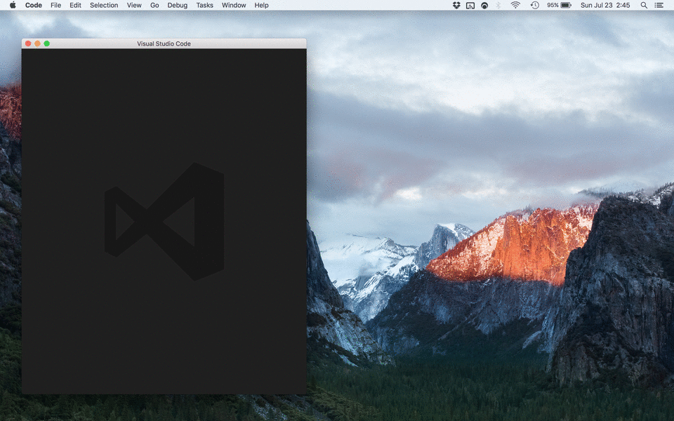
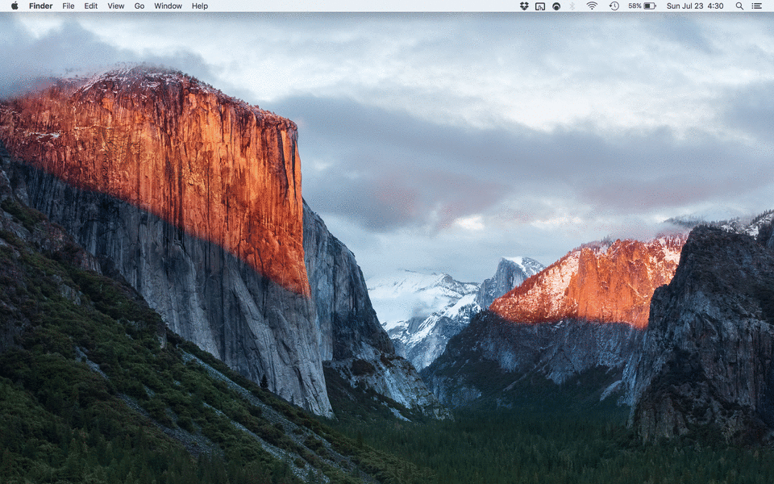
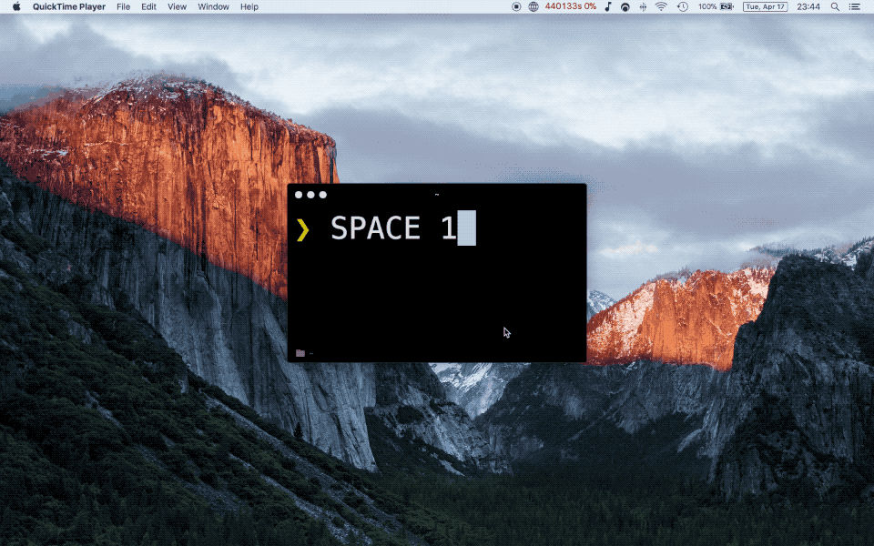
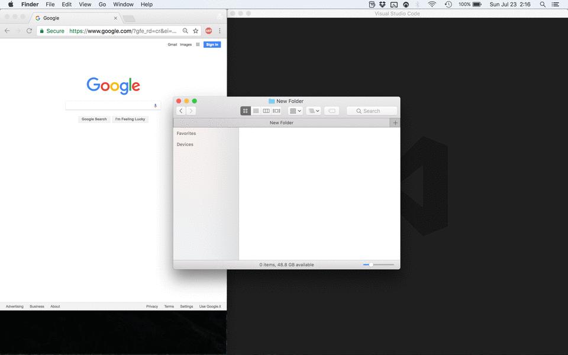
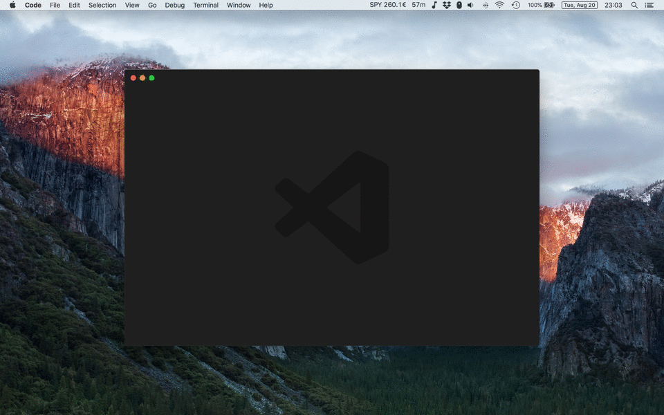
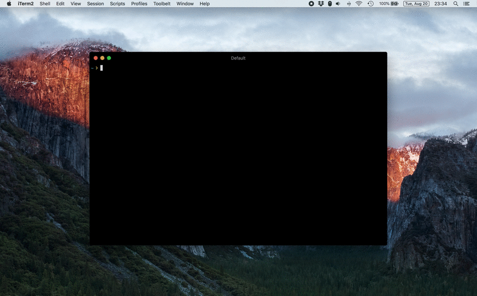

# Phoenix

My [Phoenix](https://github.com/kasper/phoenix) setup.

## Installation

This configuration uses a remap of the Caps Lock key to something more useful, the Hyper key <kbd>⇪</kbd>: basically just <kbd>Ctrl + Alt + Cmd</kbd> combined into one key. If you prefer you may skip the remap step while you try the configuration.

1. Install [Phoenix](https://github.com/kasper/phoenix#install).
2. Install [Hyperkey](https://hyperkey.app) to remap Caps lock to Hyper.
3. Execute `mkdir ~/.config`.
4. Execute `cd ~/.config`.
5. Execute `git clone git@github.com:fabiospampinato/phoenix.git`.
6. Restart Phoenix.
7. Enjoy!

## Customization

To disable specific features, just comment out their correspondent `require` call in [phoenix.js](https://github.com/fabiospampinato/phoenix/blob/master/phoenix.js).

To tweak some numbers, simply edit [constants.js](https://github.com/fabiospampinato/phoenix/blob/master/config/constants.js).

Changing the specific shortcut used to trigger an action is pretty trivial.

Don't forget to make a PR if you fixed something or implemented something cool :)

## Shortcuts

### Sides

  

| Shortcut         | Description                    |
| ---------------- | ------------------------------ |
| <kbd>⇪ + ↑</kbd> | Move window to the top side    |
| <kbd>⇪ + →</kbd> | Move window to the right side  |
| <kbd>⇪ + ↓</kbd> | Move window to the bottom side |
| <kbd>⇪ + ←</kbd> | Move window to the left side   |

### Corners

  

| Shortcut         | Description                            |
| ---------------- | -------------------------------------- |
| <kbd>⇪ + Q</kbd> | Move window to the top-left corner     |
| <kbd>⇪ + W</kbd> | Move window to the top-right corner    |
| <kbd>⇪ + S</kbd> | Move window to the bottom-right corner |
| <kbd>⇪ + A</kbd> | Move window to the bottom-left corner  |

### Halves

  

| Shortcut         | Description                 |
| ---------------- | --------------------------- |
| <kbd>⇪ + [</kbd> | Move window to the 1st half |
| <kbd>⇪ + ]</kbd> | Move window to the 2nd half |

### Thirds

  

| Shortcut         | Description                   |
| ---------------- | ----------------------------- |
| <kbd>⇪ + 1</kbd> | Move window to the 1st column |
| <kbd>⇪ + 2</kbd> | Move window to the 2nd column |
| <kbd>⇪ + 3</kbd> | Move window to the 3rd column |

### Sixths

  

| Shortcut                 | Description                  |
| ------------------------ | ---------------------------- |
| <kbd>⇪ + Shift + Q</kbd> | Move window to the 1st sixth |
| <kbd>⇪ + Shift + W</kbd> | Move window to the 2nd sixth |
| <kbd>⇪ + Shift + E</kbd> | Move window to the 3rd sixth |
| <kbd>⇪ + Shift + A</kbd> | Move window to the 4th sixth |
| <kbd>⇪ + Shift + S</kbd> | Move window to the 5th sixth |
| <kbd>⇪ + Shift + D</kbd> | Move window to the 6th sixth |

### Center

  

| Shortcut                 | Description                                          |
| ------------------------ | ---------------------------------------------------- |
| <kbd>⇪ + X</kbd>         | Center the window                                    |
| <kbd>⇪ + Shift + X</kbd> | Center the window and set its dimensions to 1280x800 |

### Grow

  

| Shortcut                 | Description                 |
| ------------------------ | --------------------------- |
| <kbd>⇪ + Shift + ↑</kbd> | Grow window from the top    |
| <kbd>⇪ + Shift + →</kbd> | Grow window from the right  |
| <kbd>⇪ + Shift + ↓</kbd> | Grow window from the bottom |
| <kbd>⇪ + Shift + ←</kbd> | Grow window from the left   |

### Expand

  

| Shortcut                     | Description                               |
| ---------------------------- | ----------------------------------------- |
| <kbd>⇪ + Space</kbd>         | Toggle window expansion to fill the space |
| <kbd>⇪ + Shift + Space</kbd> | Toggle window expansion to fullscreen     |

### Focus or Open

  

| Shortcut         | Description                                                                      |
| ---------------- | -------------------------------------------------------------------------------- |
| <kbd>⇪ + `</kbd> | Focus to or open [Notable](https://notable.md)                                   |
| <kbd>⇪ + C</kbd> | Focus to or open [Chrome](https://www.google.com/chrome)                         |
| <kbd>⇪ + D</kbd> | Focus to or open [Chrome Developer Tools](https://developer.chrome.com/devtools) |
| <kbd>⇪ + V</kbd> | Focus to or open [Visual Studio Code](https://code.visualstudio.com)             |
| <kbd>⇪ + F</kbd> | Focus to or open Finder                                                          |
| <kbd>⇪ + T</kbd> | Focus to or open Terminal                                                        |
| <kbd>⇪ + G</kbd> | Focus to or open [GitTower](https://www.git-tower.com/)                          |

### Spaces

  

In order to make this work you have to open `System Preferences -> Keyboard -> Shortcuts -> Mission Control` and bind all `Switch to Desktop [NUMBER]` actions to <kbd>Ctrl + Alt + Cmd + Shift + [NUMBER]</kbd>. There are actions up to the 9th desktop, but they may not be shown to you if you have less then 9 desktops currently open.

**Note**: If you don't need wrapping support, you should just remap the `Move left/right a space` actions under `System Preferences -> Keyboard -> Shortcuts -> Mission Control`.

| Shortcut                    | Description                  |
| --------------------------- | ---------------------------- |
| <kbd>⇪ + Tab</kbd>          | Switch to the next space     |
| <kbd>⇪ + Shift + Tab </kbd> | Switch to the previous space |

### Applications Icons

  

| Shortcut                 | Description                                                               |
| ------------------------ | ------------------------------------------------------------------------- |
| <kbd>⇪ + I</kbd>         | For each window in the current space show an icon indicating its position |
| <kbd>⇪ + Shift + I</kbd> | Display the current date and time                                         |

### Reload Phoenix

  

| Shortcut                 | Description    |
| ------------------------ | -------------- |
| <kbd>⇪ + Shift + P</kbd> | Reload Phoenix |

### Pause/Resume Application

  

This can be used for saving battery, pausing single-player games etc.

| Shortcut          | Description                             |
| ----------------- | --------------------------------------- |
| <kbd>⇪ + F8</kbd> | Pause or resume the current application |

### Quit Application

  

Did you ever close 3+ Chrome windows instead of a single tab by mistake? Fear no more! Now in order to quit an app you have to trigger <kbd>⌘Q</kbd> twice in a short timeframe. Stop [wasting 10$](https://clickontyler.com/commandq) for something so basic.

| Shortcut                    | Description      |
| --------------------------- | ---------------- |
| <kbd>⌘Q</kbd> <kbd>⌘Q</kbd> | Quit application |

### Additional Shortcuts

| Shortcut          | Description                     |
| ----------------- | ------------------------------- |
| <kbd>§</kbd>      | Remapped to `` ` ``             |
| <kbd>⇪ + =</kbd>  | Trigger the native color picker |
| <kbd>⇪ + F6</kbd> | Hide or show desktop icons      |

## Mouse

### Snapping

  

Drag a window to an edge or corner to snap it into place.

## Magic

### Chrome

If it gets opened, positionate it to the left side.

### Chrome Developer Tools

If it gets opened, positionate it to the bottom-right corner, and shrink Visual Studio Code's height a bit, so that the console will be visible.

If it gets closed, restore Visual Studio Code's height.

### Terminal/iTerm2/Finder

If one of these apps' windows gets opened, positionate it to bottom-left corner.

### Visual Studio Code

If it gets opened, positionate it to the right side.

## License

MIT © Fabio Spampinato
